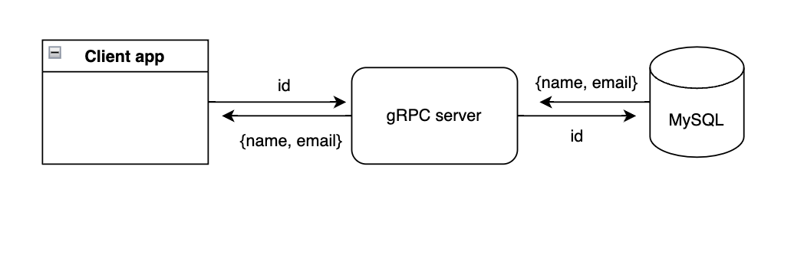
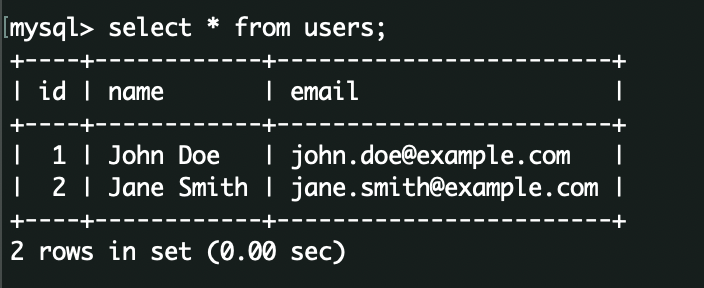
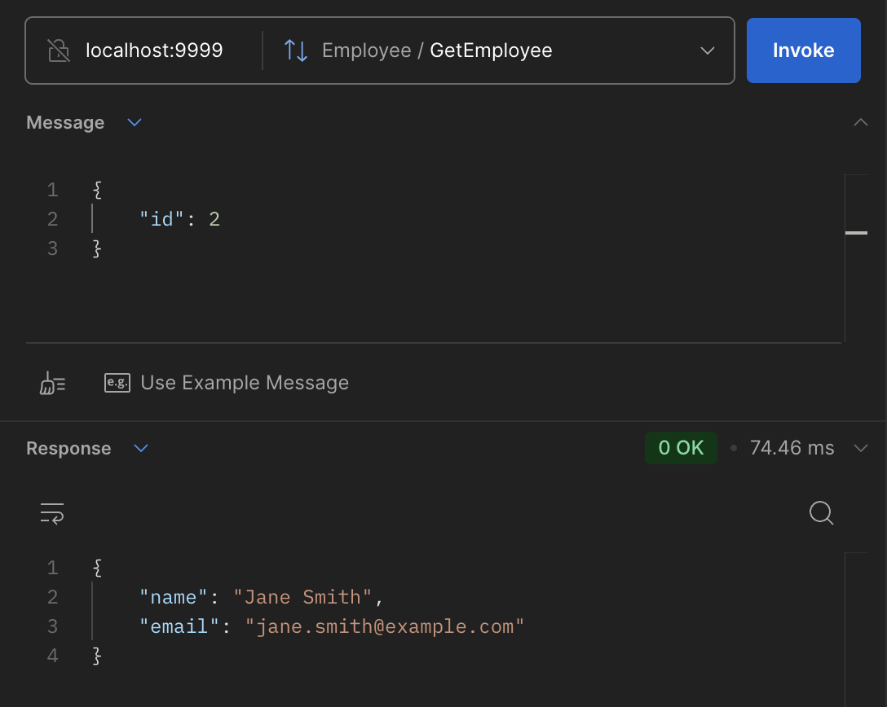

# Basic gRPC server implementation

This is the most basic gRPC server implementation

# Basic event flow -


The client requets the server with id, which the server in turn fetches the mysql DB to get the details, and sends back to the user. 

### Few setup details :
- My MySQL server was running in Docker container which mapped localhost:8101 to mysql:3306 
- My grpc sevrer is running on port localhost: 9999, you can change it as you wish.
- I ran my installation on a virtuanenv, so that my system libraries do not get messed up


Run the setup : 
> pip install -r requirements.txt

Spin up your own mysql server and check if it is up : 
> mysql -P 3306 -h 127.0.0.1 -u root -p


Feed in some data in this format : 

```
CREATE DATABASE users_db;
USE users_db;

CREATE TABLE users (
    id INT PRIMARY KEY AUTO_INCREMENT,
    name VARCHAR(100),
    email VARCHAR(100)
);

INSERT INTO users (name, email) VALUES
('John Doe', 'john.doe@example.com'),
('Jane Smith', 'jane.smith@example.com');
```

Make sure your Table looks like this : 


Generate your own protos from the message.proto
> python3 -m grpc_tools.protoc --proto_path=. ./message.proto --python_out=. --grpc_python_out=


Start the server :
> python3 server.py 

Start the client : 
> python3 client.py


Note : 
Incase you do cannot compile your message.proto, feel free to use my pre-compiled protos in the protos/ folder.
Move the message_pb2 and message_pb2_grpc from protos/ to root directory, to make it accessible to server and client, or change the location in server.py and client.py

You can also run the server, and check for the response directly from Postman. 

